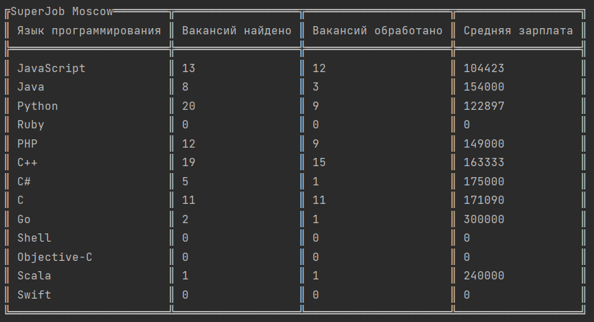

# Проект сбора статистики по вакансиям программистов на сайтах HeadHunter и SuperJob.

Проект - совокупность скриптов для автоматизации сбора информации о вакансиях программистов в г. Москва с сайтов HeadHunter и SuperJob.

Основной скрипт выводит информацию в табличной форме о средней зарплате и количестве просмотренных вакансий в разрезе самых популярных языков программирования на момент написания проекта.
Полный список поиска:
* "JavaScript"
* "Java"
* "Python"
* "Ruby"
* "PHP"
* "C++"
* "C#"
* "C"
* "Go"
* "Shell"
* "Objective-C"
* "Scala"
* "Swift"


## Как установить

Python3 должен быть уже установлен. 
Затем используйте `pip` (или `pip3`, есть конфликт с Python2) для установки зависимостей:
```
pip install -r requirements.txt
```
Для корректной работы понадобится в корневом каталоге проекта в файле `.env` прописать свой токен (`SUPERJOB_API_KEY`) для сайта superjob.ru. По ссылке можно получить токен:[инструкции](https://api.superjob.ru/) 
```
SUPERJOB_API_KEY=<SUPERJOB_API_KEY>
```

## Использование скриптов

Проект включает в себя несколько скриптов, имеющие следующий функционал.

### Основной исполняемый скрипт `main.py`
Выводит информацию в табличной форме о средней зарплате и количестве просмотренных вакансий в разрезе самых популярных языков программирования, сразу для двух площадок HeadHunter и SuperJob.

Пример запуска:
```bash
python main.py
```

Пример работы скрипта:




### Вспомогательный скрипт `hh_vacancies.py`
Выводит информацию в табличной форме о средней зарплате и количестве просмотренных вакансий в разрезе указанных языков программирования на HeadHunter (г.Москва).

Принимает обязательный аргумент: 
* "-l", "--languages", - список языков программирования для поиска вакансий.


Пример запуска:
```bash
python hh_vacancies.py -l 'Python', 'C++', 'Java'
```
Пример работы аналогичен основному скрипту.

### Вспомогательный скрипт `sj_vacanciespy`
Выводит информацию в табличной форме о средней зарплате и количестве просмотренных вакансий в разрезе указанных языков программирования на SuperJob (г.Москва).
Требует получения SUPERJOB_API_KEY, который должен быть указан в переменной .env

Принимает обязательный аргумент: 
* "-l", "--languages", - список языков программирования для поиска вакансий.


Пример запуска:
```bash
python sj_vacancies.py -l 'Python', 'C++', 'Java'
```
Пример работы аналогичен основному скрипту.
